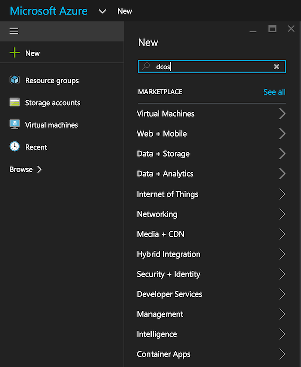
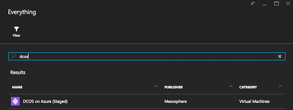
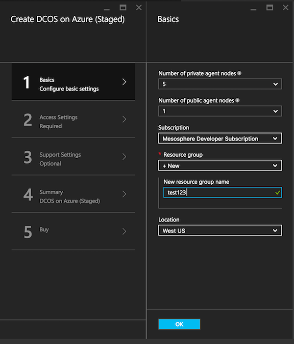
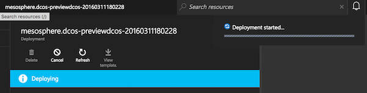
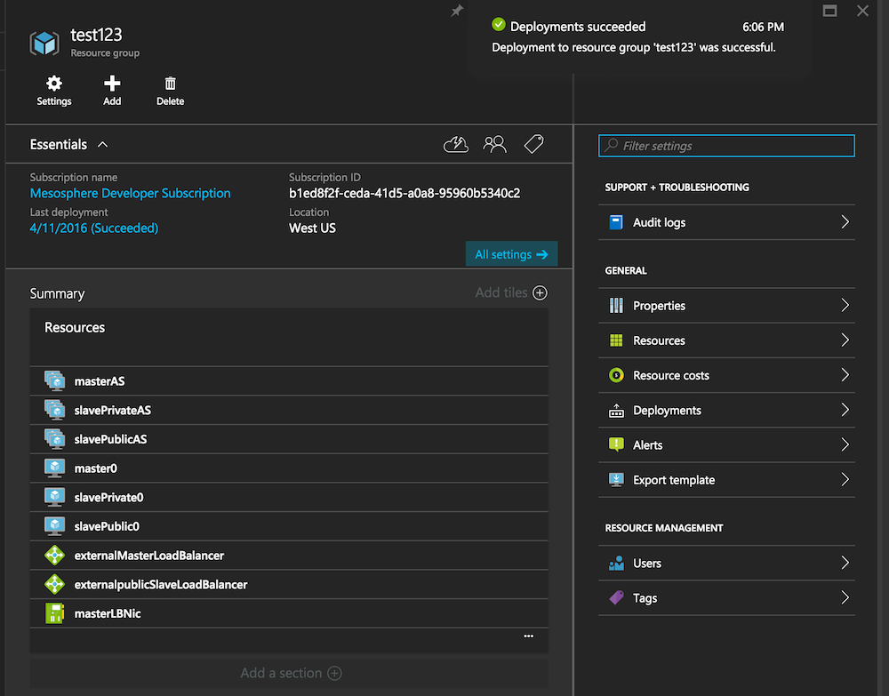
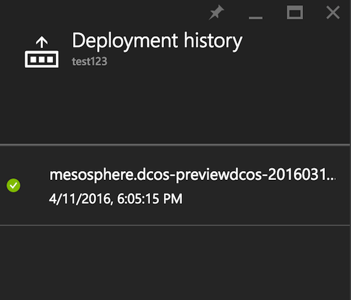
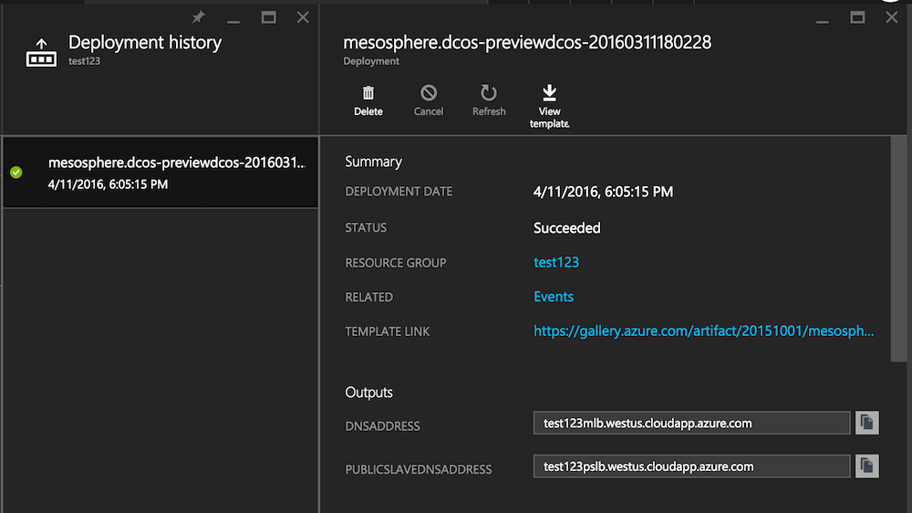

# Overview

This document explains how to install DC/OS via the [Azure Marketplace](https://azure.microsoft.com/en-us/marketplace/).

TIP: In order to get support on Azure Marketplace-related questions, you can join the respective [Slack community](http://join.marketplace.azure.com).

# System requirements

## Hardware

In order to [use](/docs/1.7/usage/) all of the services offered in DC/OS you should choose at least five Mesos Agents using `Standard_D2` [Virtual Machines](https://azure.microsoft.com/en-us/pricing/details/virtual-machines/), which is the default size in the DC/OS Azure Marketplace offering.

Selecting smaller-sized VMs is not recommended, and selecting fewer VMs will likely cause certain resource-intensive services such as distributed datastores not to work properly (from installation issues to operational limitations).

## Software

You will need an active [Azure subscription](https://azure.microsoft.com/en-us/pricing/purchase-options/) to install DC/OS via the Azure Marketplace.

Also, in order to access nodes in the DC/OS cluster you will need `ssh` installed and configured.

# Install DC/OS

## Step 1: Deploying the template

In order to deploy DC/OS using an [Azure Resource Manager](https://azure.microsoft.com/en-us/documentation/articles/resource-group-overview/) template, first go to [portal.azure.com](https://portal.azure.com/), click on `+ New` and enter `dcos`:

In the search result page, pick `DC/OS on Azure`:

In the template, click on `Create`:

Complete the installation wizard steps. Note: you only need to fill in the `Basic` section, rest is optional, however you SHOULD create a new resource group:

After you've clicked on the final `Create` button you should see something like the following (note that depending on the number of nodes you selected it may take several minutes until the cluster has been deployed, for example, for the default configuration of 5 nodes it takes usually some 15min):

Once the deployment succeeded, you should see the following (if not, delete the deployment and the resource group and start again):

Now you have deployed DC/OS using an Azure Resource Manager template, congrats! Next we will have a look at accessing the cluster.

## Step 2: Accessing DC/OS

Due to security considerations the DC/OS cluster in Azure is locked down per default. You need to use an `ssh` tunnel to access the DC/OS Dashboard.

First, look up `master-lb-hostname` in the outputs of the deployment. To find that, click on the link under `Last deployment` (which is `4/11/2016 (Succeeded)` here) and you should see this:

Click on the latest deployment and copy the value of `master-lb-hostname` in the `Outputs` section:

Use the value of `master-lb-hostname` you found in the `Outputs` section in the previous step and paste it in the following command:

    $ ssh azureuser@master-lb-hostname -p 2200 -L 8000:localhost:80

For example, in my case:

    $ ssh azureuser@test123mlb.westus.cloudapp.azure.com -p 2200 -L 8000:localhost:80

Now you can visit `http://localhost:8000` on your local machine and find the DC/OS Dashboard there.

# Next steps

- [Install the DC/OS Command-Line Interface (CLI)][1].
- [Scaling considerations][2]

[1]: /docs/1.7/usage/cli/install/
[3]: https://azure.microsoft.com/en-us/documentation/articles/best-practices-auto-scaling/
