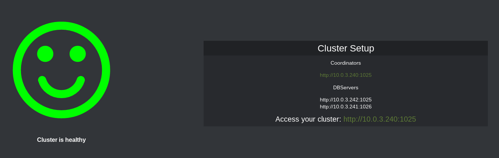
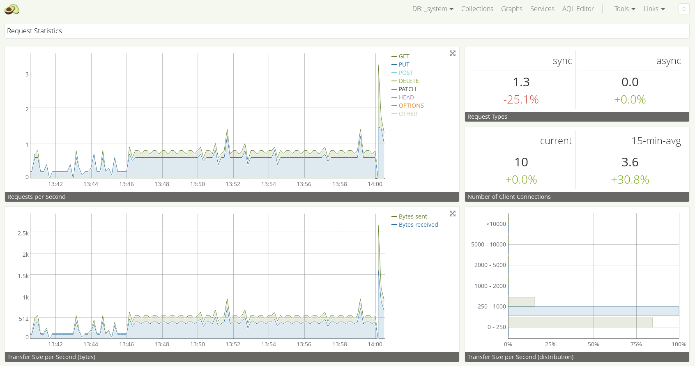

ArangoDB is a distributed, multi-model database featuring JSON
documents, graphs, and key/value pairs. It has a unified query language (AQL)
that allows you to mix all three data models and supports joins and
transactions.

**Time Estimate**:

~5 minutes

**Target Audience**:

Anyone who wants to deploy a distributed multi-model database on DC/OS. Beginner level.

**Scope**:

This tutorial covers the basics in order to get you started with ArangoDB on DC/OS.

## Prerequisites

- A running DC/OS cluster
- [DC/OS CLI](/docs/1.7/usage/cli/install/) installed

## Install ArangoDB on DC/OS

The DC/OS CLI provides a convenient way to deploy applications on your DC/OS cluster.

Deploying ArangoDB via the DC/OS CLI is as easy as:

```bash
$ dcos package install arangodb
```

This command installs the `arangodb` subcommand and starts an instance of the ArangoDB service with its default configuration under its standard name, "arangodb" via Marathon.

Open the DC/OS web interface in your browser and click the Services tab to watch ArangoDB start up on your Open DC/OS cluster:


Click the ArangoDB task to reveal the subtask that the framework has started:


Click “Open Service” to open the ArangoDB dashboard:



By default, ArangoDB will not expose itself to the outside. The IPs listed here are the internal IPs in the cluster. To access the nodes from the outside, we recommend using [sshuttle](https://github.com/sshuttle/sshuttle).

The exact way to dig a tunnel using sshuttle varies from infrastructure to infrastructure. The following is an example for an AWS cluster:

```bash
$ sshuttle --python /opt/mesosphere/bin/python3.4 -r core@54.171.143.132 10.0.0.0/8
```

The IP may be extracted from the top left corner of the DC/OS web interface:


**Note:** Some sshuttle versions had problems during our tests. Version 0.77.3 worked properly for us.

Afterwards, you should be able to access the internal IPs from outside. Click the coordinator link in the ArangoDB web interface to open the ArangoDB coordinator:



Congratulations! You now have ArangoDB running on DC/OS.

## Further reading

### Service discovery

ArangoDB integrates with [DC/OS service discovery](/docs/1.7/usage/service-discovery/mesos-dns/service-naming/). You should use this to talk to the coordinator from within the cluster. To find out the IP of the coordinator, do a standard DNS lookup for `arangodb-coordinator1.arangodb.mesos`.

Then, issue a SRV DNS request to `arangodb-coordinator1.arangodb.mesos` to find out the port.

### Deinstallation/Shutdown

Use the following commands to shut down and delete your ArangoDB service and the
command line tool:

```bash
$ dcos arangodb uninstall; dcos package uninstall arangodb
```

The first command uses the `arangodb` subcommand to gracefully shut down and
delete all instances of your ArangoDB service. The framework scheduler
itself will run in silent mode for another 120 seconds. This enables
the second command to remove the `arangodb` subcommand and the entry in
Marathon that would otherwise restart the framework scheduler
automatically.

### Configuration options

There are a number of configuration options, which can be specified in the following
way:

```bash
$ dcos package install --config=<JSON_FILE> arangodb
```

where `JSON_FILE` is the path to a JSON file. For a list of possible
attribute values and their documentation see

```bash
$ dcos package describe --config arangodb
```

### Further Information

For further information, visit: https://github.com/arangoDB/arangodb-mesos-framework

The ArrangoDB service is also distributed in binary form as a Docker image: arangodb/arangodb-mesos-framework

See the [README.md](https://github.com/ArangoDB/arangodb-mesos-framework)
in the framework repository for details on how the framework scheduler is
configured.

### Support and bug reports

The ArangoDB Mesos framework and the DC/OS subcommand are
supported by ArangoDB GmbH, the company behind ArangoDB. If you get
stuck, need help or have questions, just ask via one of the following
channels:

- [Slack](http://slack.arangodb.com)
- [Google Group](https://groups.google.com/forum/#!forum/arangodb)
- `hackers@arangodb.com`: developer mailing list of ArangoDB
- `max@arangodb.com`: direct email to Max Neunhöffer
- `frank@arangodb.com`: direct email to Frank Celler
- `mop@arangodb.com`: direct email to Andreas Streichardt

Additionally, we track issues, bug reports, and questions via the GitHub
issue trackers at

- [arangodb-dcos](https://github.com/ArangoDB/arangodb-dcos/issues): The DC/OS subcommand
- [arangodb-mesos](https://github.com/arangodb/arangodb-mesos/issues): The ArangoDB service
