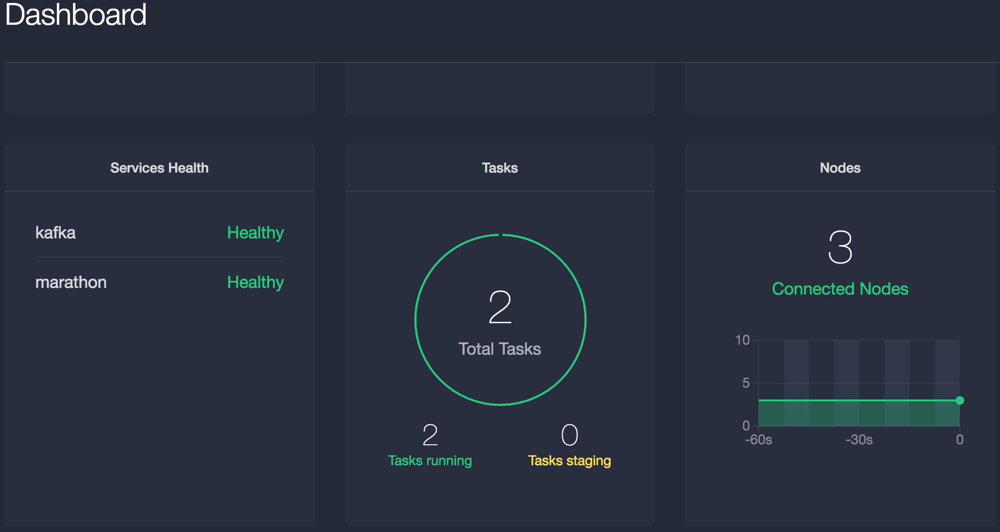
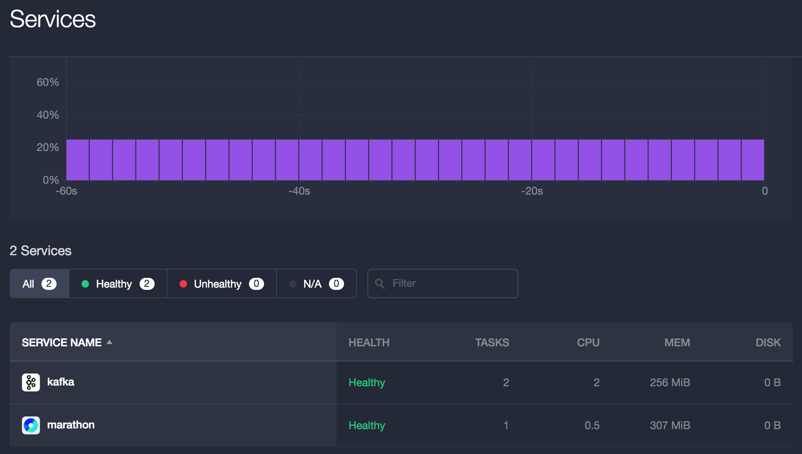
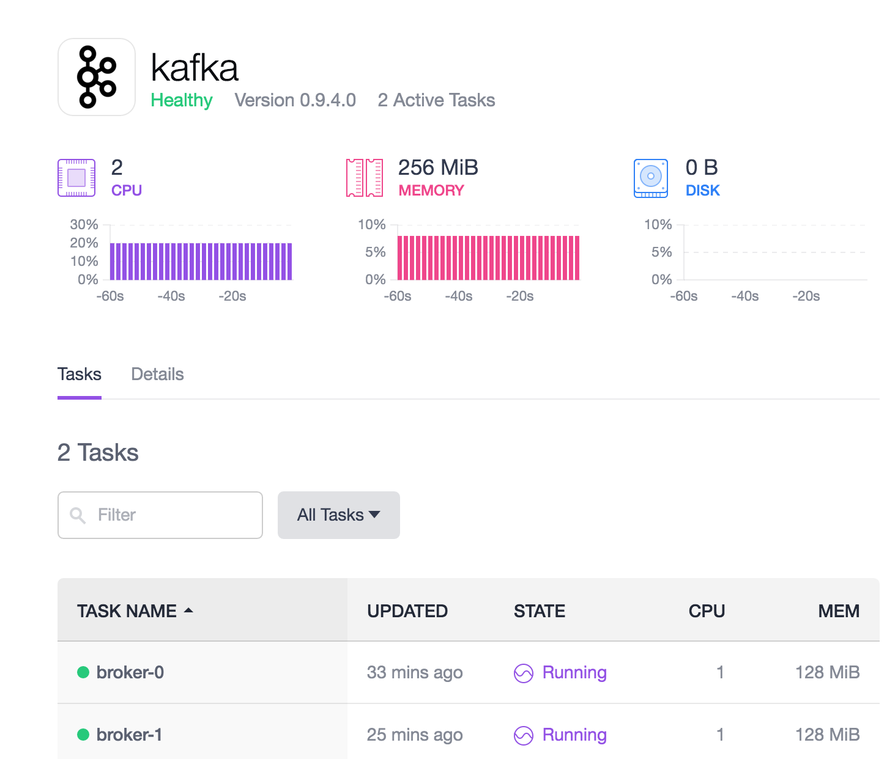

[Apache Kafka](https://kafka.apache.org/) is a distributed high-throughput publish-subscribe messaging system with strong ordering guarantees. Kafka clusters are highly available, fault tolerant, and very durable. DC/OS Kafka gives you direct access to the Kafka API so that existing producers and consumers can interoperate. You can configure and install DC/OS Kafka in moments. Multiple Kafka clusters can be installed on DC/OS and managed independently, so you can offer Kafka as a managed service to your organization.

Kafka uses [Apache ZooKeeper](https://zookeeper.apache.org/) for coordination. Kafka serves real-time data ingestion systems with high-throughput and low-latency. Kafka is written in Scala.

**Time Estimate**:

Approximately 20 minutes.

**Target Audience**:

- Anyone interested in automated administration

**Terminology**:

- **pub/sub:** Publish/Subscribe messaging pattern
- **Broker:** A Kafka message broker that routes messages to one or more topics
- **Topic:** A Kafka topic is message filtering mechanism in the pub/sub systems. Subscribers register to receive/consume messages from topics
- **Publisher:** An application that publishes messages on Kafka
- **Consumer:** An application that consumes messages from Kafka
- **Universe:** The default DC/OS repository

**Scope**:

In this tutorial you will learn:
* How to install the Kafka service
* How to validate that the service is up and running
* How to use the enhanced DC/OS CLI operations for Kafka
* How to use Kafka on DC/OS to launch brokers and publish/consume messages

## Table of Contents

  * [Prerequisites](#prerequisites)
  * [Install Kafka](#install-kafka)

    * [Typical installation](#typical-installation)
    * [Custom manual installation procedure](#custom-manual-installation-procedure)
    * [Manual installation via the web interface](#manual-installation-via-the-web-interface)
    * [Validate installation](#validate-installation)

  * [DC/OS Kafka operations](#dcos-kafka-operations)
  * [Cleanup](#cleanup)
  * [API Reference](#api-reference)


## Prerequisites

- A running DC/OS cluster with three nodes, each with 2 CPUs and 2 GB of RAM available
- [DC/OS CLI](/docs/1.7/usage/cli/install/) installed

## Install Kafka

### Typical installation

Install Kafka using the DC/OS CLI:

```bash
$ dcos package install kafka
This will install Apache Kafka DC/OS Service.
Continue installing? [yes/no] yes
Installing Marathon app for package [kafka] version [0.9.4.0]
Installing CLI subcommand for package [kafka] version [0.9.4.0]
New command available: dcos kafka
The Apache Kafka DC/OS Service is installed:
  docs   - https://github.com/mesos/kafka
  issues - https://github.com/mesos/kafka/issues
```

While the DC/OS command line interface (CLI) is immediately available, it takes a few minutes for the Kafka service to start.

### Custom manual installation procedure

1. Verify existing DC/OS repositories:

    ```bash
    $ dcos package repo list
    Universe: https://universe.mesosphere.com/repo
    ```

1. Identify available versions for the Kafka service

    You can either list available version:

    ```bash
    $ dcos package list kafka
    ```

    Or you can search for a particular one:

    ```bash
    $ dcos package search kafka
    ```

1. Install or upgrade to a specific version of the Kafka package:

    ```bash
    $ dcos package install --yes --force --package-version=<package_version> kafka
    ```

### Manual installation via the web interface

You can also install the Kafka service from DC/OS Universe dashboard - http://dcos-cluster/#/universe/packages/.

### Validate installation

Validate that the installation added the enhanced DC/OS CLI for Kafka:

```bash
$ dcos package list kafka; dcos kafka help
```

Validate that Kafka service is healthy:




## DC/OS Kafka operations

- Add brokers:

```bash
$ dcos kafka broker add 0..2
```

- Start brokers:

```bash
$ dcos kafka broker start 0..2
```

- Remove brokers:

```bash
$ dcos kafka broker stop 1..2
$ dcos kafka broker remove 1..2
```

**Note:** Brokers have to be stopped before removal.

Expected outcome:

```bash
brokers 1,2 removed
```

- List Kafka brokers

```bash
$ dcos kafka broker list
```

- Update broker:

```bash
$ dcos kafka broker stop 0 &&\
$ dcos kafka broker update 0 --mem 128 --heap 64 &&\
$ dcos kafka broker start 0
```

**Note:** A broker needs to be stopped in order to be updated.

Expected outcome:

```bash
broker started:
  id: 0
  active: true
  state: running
  resources: cpus:1.00, mem:128, heap:64, port:auto
  failover: delay:1m, max-delay:10m
  stickiness: period:10m, hostname:192.168.65.121
  task:
    id: broker-0-52ca36ad-d34b-48fc-8692-ac438e76c130
    state: running
    endpoint: 192.168.65.121:1025
```


- Add a broker with options provided:

```bash
$ dcos kafka broker add 1 --mem 128 --heap 64 && dcos kafka broker start 1
```

Expected outcome:

```bash
broker started:
  id: 1
  active: true
  state: running
  resources: cpus:1.00, mem:128, heap:64, port:auto
  failover: delay:1m, max-delay:10m
  stickiness: period:10m, hostname:192.168.65.121
  task:
    id: broker-1-40276308-8122-4e9c-b645-b6b98b46b5f1
    state: running
    endpoint: 192.168.65.121:1026
```



- Add a topic:

```bash
$ dcos kafka topic add t0 --broker 0
```

- Publish and consume messages:

```bash
$ dcos kafka topic create topic1 --partitions 3 --replication 3
$ dcos kafka connection
$ dcos node ssh --master-proxy --master
$ docker run -it mesosphere/kafka-client
$ ./kafka-console-producer.sh --broker-list ip-10-0-3-230.us-west-2.compute.internal:9092 --topic test
This is a message
This is another message
$ ./kafka-console-consumer.sh --zookeeper master.mesos:2181/kafka --topic test --from-beginning
This is a message
This is another message
```

## Cleanup

### Uninstall

```bash
$ dcos package uninstall kafka
```

### Purge/clean up persisted state:

[Kafka uninstall](http://docs.mesosphere.com/services/kafka/#uninstall)

## API Reference

- [https://kafka.apache.org/documentation.html](https://kafka.apache.org/documentation.html)
