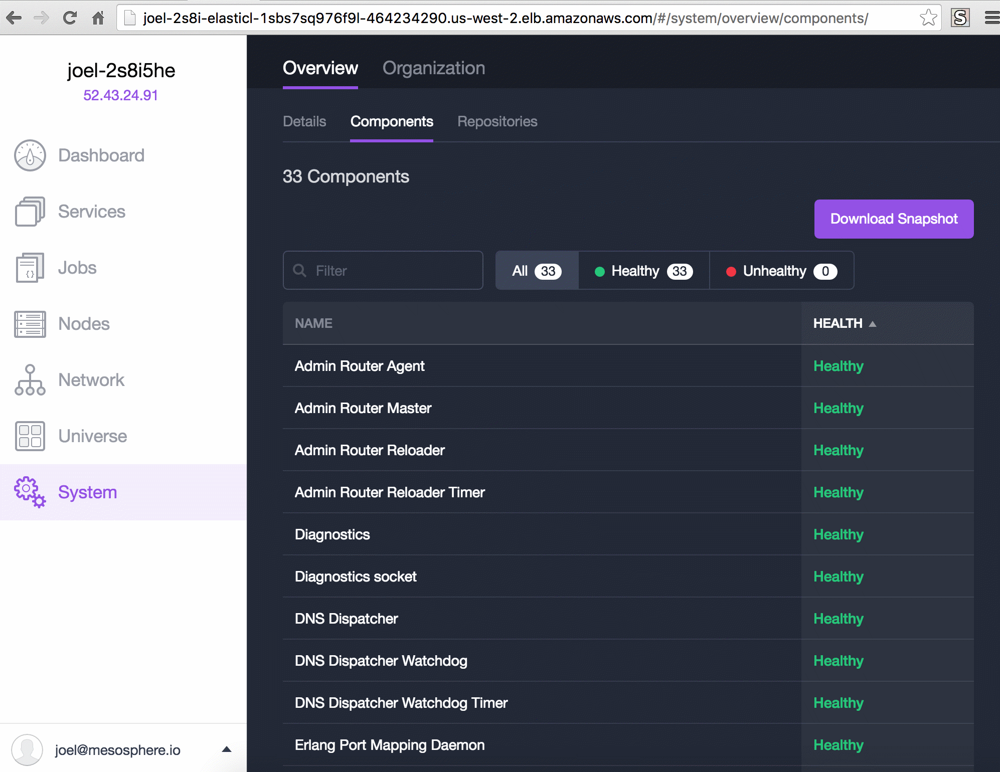
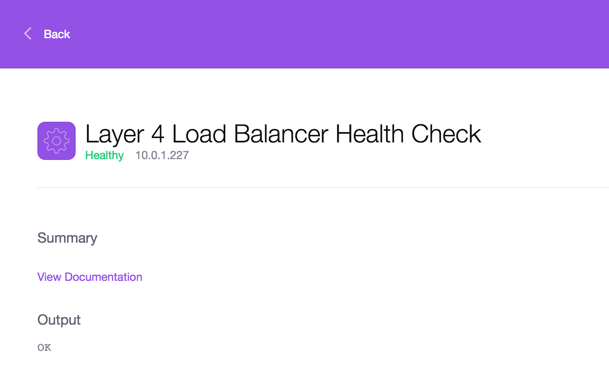

Monitoring the health of all the pieces that make up DC/OS is vital to datacenter operators and for troubleshoooting hard-to-diagnose bugs. You can monitor the health of your cluster components from the DC/OS UI component health page. The component health page displays information from the system health API, which monitors the core DC/OS components.

The component health page provides the health status of all DC/OS system components that are running in systemd. You can drill down by health status, host IP address, or specific systemd unit.

## Getting Started
Launch the [DC/OS UI](/docs/1.8/usage/webinterface/) and navigate to the **System -> Components** page. You can sort components by health.



You can click on a DC/OS component to view the details, including role, node, and health.


You can debug further by clicking the node to view the component journald (log) output:



## Health States

Possible health states are unhealthy and healthy. We infer this from codes 0 and 1.

- **Healthy** All cluster nodes are healthy. The units are loaded and not in the "active" or "inactive" state.
- **Unhealthy** One or more nodes have issues. The units are not loaded or are in the "active" or "inactive" state.

The system health API has four possible states: 0 - 3, OK; CRITICAL; WARNING; UNKNOWN. Future DC/OS iterations will leverage these codes to provide more robust and detailed cluster health state information in the UI.

## System health HTTP API endpoint

The system health endpoint is exposed at port 1050:

```bash
$ curl <host_ip>:1050/system/health/v1
```

## Aggregation

Aggregation of the cluster health endpoints is accomplished by the same diagnostics application, but is only run on the master nodes. You can explore this API further by making a few queries to any master in your cluster:

```bash
$ curl <master_ip>:1050/system/health/v1/units
$ curl <master_ip>:1050/system/health/v1/nodes
$ curl <master_ip>:1050/system/health/v1/report
```

The DC/OS user interface uses these aggregation endpoints to generate the data you explore in the system health console.

## Components

DC/OS components are the [systemd units](https://www.freedesktop.org/wiki/Software/systemd/) that make up the core of DC/OS. These components are monitored by our internal diagnostics utility (`dcos-diagnostics.service`). This utility scans all the DC/OS units, and then exposes an HTTP API on each host.

You can query this HTTP API for any host in the cluster:

```bash
curl <host_ip>:1050/system/health/v1
```

Here is an explanation of the components shown in the UI.

### Admin Router
This component is an open-source Nginx configuration created by Mesosphere that provides central authentication and proxy to DC/OS services within the cluster.<!-- dcos-adminrouter.service/ -->

### Admin Router Agent
This component is a high performance web server and a reverse proxy server that lists all of the agent nodes in your cluster.
 
### Admin Router Master
This component is a high performance web server and a reverse proxy server that lists all of the master nodes in your cluster.

### Admin Router Reloader
This component restarts the Admin Router Nginx server so that it can pick up new DNS resolutions, for example `master.mesos` and `leader.mesos`.<!-- dcos-adminrouter-reload.service/ -->

### Admin Router Reloader Timer
This component sets the Admin Router Reloader interval at once per hour.<!-- dcos-adminrouter-reload.timer/ -->

### Diagnostics
This component informs DC/OS of individual node health for things like system resources as well as DC/OS-specific services.<!-- dcos-ddt.service/ -->

### Diagnostics socket
This component is the DC/OS Distributed Diagnostics Tool master API and aggregation socket. 

### DNS Dispatcher
This component is an RFC5625 Compliant DNS Forwarder. It's job is to dual-dispatch DNS to multiple upstream resolvers, and to route DNS to the upstreams or Mesos DNS, depending on some rules.<!-- dcos-spartan.service/ -->

### DNS Dispatcher Watchdog
This component ensures that the DNS Dispatcher is running and healthy. If the DNS Dispatcher is unhealthy, this watchdog service kills it.<!-- dcos-spartan-watchdog.service/ -->

### DNS Dispatcher Watchdog Timer
This component wakes up the DNS Dispatcher Watchdog every 5 minutes, to see if DC/OS needs to restart DNS Dispatcher. <!-- dcos-spartan-watchdog.timer/ -->

### Erlang Port Mapping Daemon
This component acts as a name server on all hosts involved in distributed Erlang computations. For more information, see the [documentation](http://erlang.org/doc/man/epmd.html). <!-- dcos-epmd.service/ -->

### Exhibitor
This component is the Exhibitor supervisor for Zookeeper. <!-- dcos-exhibitor.service/ -->

### Generate resolv.conf
This component allows the agent nodes locate the master nodes.<!-- dcos-gen-resolvconf.service/ -->

### Generate resolv.conf Timer
This component periodically updates the systemd-resolved for Mesos DNS.<!-- dcos-gen-resolvconf.timer/ -->

### Job Service
This component powers the DC/OS Jobs feature. For more information, see the [documentation](/docs/1.8/usage/jobs/).

### Layer 4 Load Balancer
This component is the DC/OS Layer 4 Load Balancer that enables multi-tier microservices architectures. For more information, see the [documentation](/docs/1.8/usage/service-discovery/load-balancing/).<!-- dcos-minuteman.service/ -->

### Logrotate Mesos Master
This component automatically rotates compression, removal, and mailing of log files for master nodes.

### Logrotate Mesos Slave
This component automatically rotates compression, removal, and mailing of log files for agent nodes.

### Logrotate Timer
This component sets the logrotate interval at 2 minutes. <!-- dcos-logrotate.timer/ -->

### Marathon
This component is the DC/OS Marathon instance which starts and monitors DC/OS applications and services.<!-- dcos-marathon.service/ -->

### Mesos Agent
This component is the mesos-slave process for [private](/docs/1.8/overview/concepts/#private) agent nodes.<!-- dcos-mesos-slave.service/ -->

### Mesos Agent Public
This component is the mesos-slave process for [public](/docs/1.8/overview/concepts/#public) agent nodes.<!-- dcos-mesos-slave-public.service/ -->

### Mesos DNS
This component is Mesos-DNS, which provides service discovery within the cluster. For more information, see the [documentation](/docs/1.8/usage/service-discovery/mesos-dns/).<!-- dcos-mesos-dns.service/ -->

### Mesos History
This component enables the DC/OS web interface to display cluster usage statistics.<!-- dcos-history-service.service/ -->

### Mesos Master
This component is the mesos-master process that orchestrates agent tasks.<!-- dcos-mesos-master.service/ -->

### Mesos Persistent Volume Discovery
This component connects to existing Mesos volume mounts on agent nodes during installation. For more information on Mesos Persistent Volumes, see the [documentation](http://mesos.apache.org/documentation/latest/persistent-volume/). <!-- dcos-vol-discovery-pub-agent.service/ -->

### Navstar
This component is a daemon that provides virtual networking and DNS services. It is the network overlay orchestrator. For more information, see the [documentation](https://github.com/dcos/navstar).

### OAuth
This component provides the DC/OS authorization service. <!-- dcos-oauth.service/ -->

### Package Service
This component manages the Universe package repositories. <!-- dcos-cosmos.service/ -->

### REX-Ray
This component provides external persistent volumes. For more information, see the [documentation](/docs/1.8/usage/service-guides/marathon/external-volumes/).

### Signal
This component sends a periodic ping back to Mesosphere with high-level cluster information to help improve DC/OS, and provides advanced monitoring of cluster issues.<!-- dcos-signal.service/ -->

### Signal Timer
This component sets the Signal component interval at once per hour.<!-- dcos-signal.timer/ -->

## Known Issues

### Misinterpreting System Health by Unit

You can sort system health by systemd unit. However, this search can bring up misleading information as the service itself can be healthy but the node on which it runs is not. This manifests itself as a service showing "healthy" but nodes associated with that service as "unhealthy". Some people find this behavior confusing.

### Missing Cluster Hosts

The system health API relies on Mesos-DNS to know about all the cluster hosts. It finds these hosts by combining a query from `mesos.master` A records as well as `leader.mesos:5050/slaves` to get the complete list of hosts in the cluster.

This system has a known bug where an agent will not show up in the list returned from `leader.mesos:5050/slaves` if the Mesos agent service is not healthy. This means the system health API will not show this host.

If you experience this behavior it's most likely your Mesos agent service on the missing host is unhealthy.

## Troubleshooting

If you have any problems, you can check if the diagnostics service is running by SSH’ing to the Mesos leading master and checking the systemd status of the `dcos-ddt.service`.
